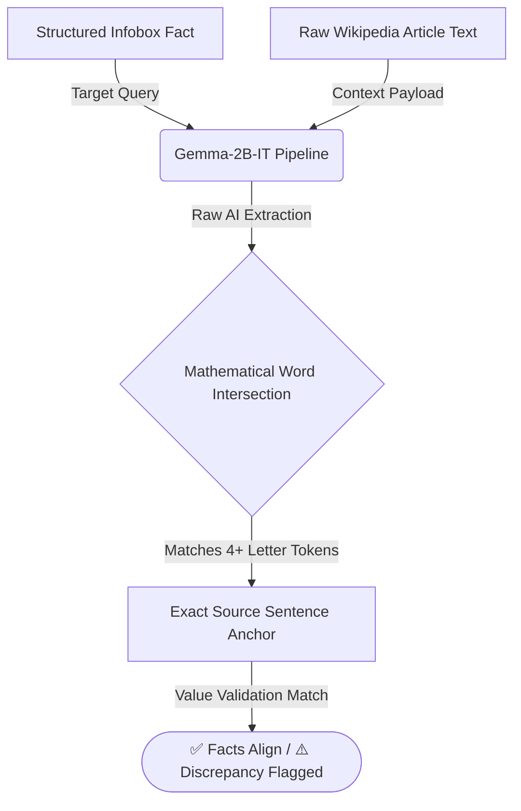

```markdown
# <p align="center">🕵️‍♂️ WIKIFACT CHECK AI</p>
<p align="center">
  
  
  
</p>

---

> **🏆 Official Hackathon Submission Notice:** This project was fully ported, integrated, and validated against the official **Wikimedia Structured Contents Kaggle Dataset** to combat AI hallucinations through mathematical text anchoring.

---

## ⚡ Quick Navigation
- [🚀 Phase 1: Official Kaggle Deployment](#-phase-1-official-kaggle-deployment)
- [💻 Phase 2: Original Engineering Build](#-phase-2-original-engineering-build)
- [🧠 Core Architecture & Math Engine](#-core-architecture--math-engine)

---

## 📂 Phase 1: Official Kaggle Deployment

<details>
<summary><b>👉 Click to Expand Kaggle Integration Details & Instructions</b></summary>

The production-ready architecture has been migrated to Kaggle to directly interface with the massive Wikimedia dataset repository.

* 🔗 **Live Notebook Environment:** [Open WikiFact Check AI on Kaggle] https://www.kaggle.com/code/samanyup/wiki-fact-check

### 🕹️ Step-by-Step Testing Guide for Judges:
1. Click the Kaggle link above and hit the black <kbd>Copy & Edit</kbd> button in the top right.
2. In the right-hand panel, expand **Session options** and verify the **Internet** toggle is switched **ON**.
3. Go to **Add-ons -> Secrets** at the top menu and securely attach your Hugging Face token labeled as `HF_TOKEN`.
4. Click **Run All**. 
5. Use the new **📂 Load Kaggle Sample** button in the Gradio interface to instantly pull raw data schemas from the Wikimedia dataset and test the anti-hallucination engine!

</details>

---

## 💻 Phase 2: Original Local & Colab Build

<details>
<summary><b>👉 Click to Expand Original Development Build & Video Demo</b></summary>

The standalone baseline architecture developed during the primary sprint cycle, featuring full UI implementation and modular script design.

* 🎥 **Video Demonstration Walkthrough:** [Watch the Full Pipeline Demo] https://github.com/user-attachments/assets/5052001a-a2e6-49dc-a42e-a494e7d122e9

### ⚙️ Local Execution Instructions:
1. Clone this repository locally or open it in Google Colab.
2. Store your Hugging Face credentials safely in your environment variables as `HF_TOKEN`.
3. Install the required runtime packages:
   ```bash
   pip install -q -U transformers accelerate gradio

```

4. Execute the main application script:
```bash
python app.py

```


5. Click the generated public `gradio.live` link to launch the interactive interface.

---

## 🧠 System Architecture & Anti-Hallucination Logic

WikiFact Check AI solves the critical flaw of standard LLM paraphrasing by combining generative AI with strict **Python-based mathematical anchoring**:



1. **AI Extraction:** The `google/gemma-2b-it` model parses the specific target variable from the article text based on the provided infobox query.
2. **Mathematical Anchoring:** A custom token-intersection algorithm (`re.findall`) parses the original article into individual sentences and scores them against the model's output to pin down the exact matching sentence.
3. **Deterministic Safety:** Prevents the model from generating fabricated "hallucinated" explanations by hard-anchoring every output back to verbatim source text.


```
